#  Vectorized Image Processing Engine (Pure NumPy)

> A high-performance image processing module built with **PySide6** and **pure NumPy**, featuring a custom convolution engine and a full Canny Edge Detection pipeline implemented from first principles.This work focuses specifically on low-level algorithmic implementation using pure NumPy rather than high-level computer vision libraries.

---

##  Overview

This project implements a **modular, high-performance image processing engine** from scratch in Python.

Unlike typical implementations that rely on libraries such as OpenCV or scikit-image, this system is built entirely using **NumPy-based numerical operations**, demonstrating a strong understanding of:

* Matrix transformations
* Convolution operations
* Gradient-based edge detection
* Performance-aware numerical computing

The module integrates into a GUI-based application via a **plug-in architecture**, enabling extensibility and real-time user interaction.

---

##  Core Features

### 🔹 Custom Canny Edge Detection (From Scratch)

A complete multi-stage pipeline:

* Gaussian smoothing (5×5 kernel)
* Sobel gradient computation
* Gradient magnitude + direction
* Non-maximum suppression
* Double thresholding
* Edge tracking via hysteresis

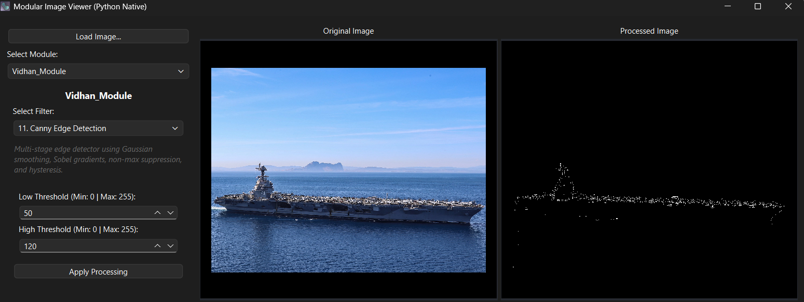

---

### 🔹 Vectorized Processing Engine

* NumPy-based operations for high performance
* Lookup Table (LUT) optimization for gamma correction
* Memory-efficient pixel transformations

---

### 🔹 Convolution Framework

* Built-in filters:

  * Box Blur (smoothing)
  * Sharpening (Laplacian)
* **Custom 3×3 kernel input**
* Automatic normalization to prevent overflow

| Box Blur / Smoothing | Sharpening (Laplacian) | Custom Convolution |
|---|---|---|
| 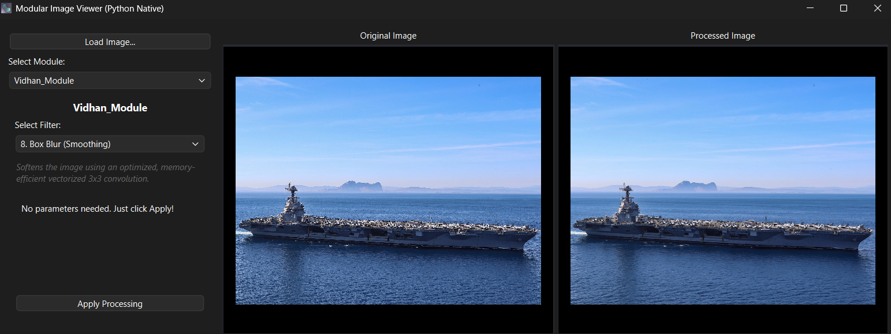 | _Filter.png>) | 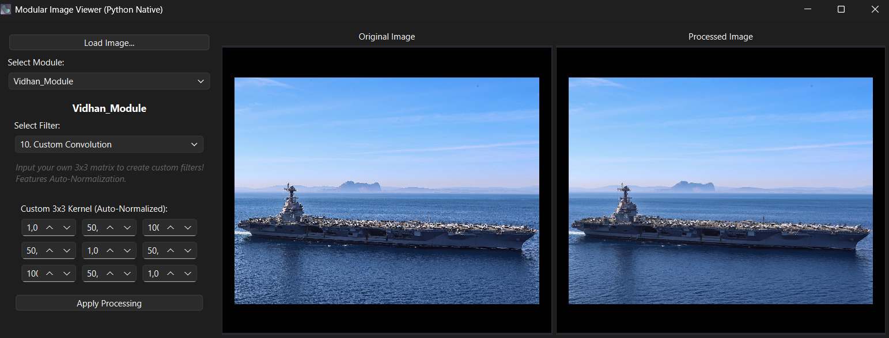 |

---

### 🔹 Color Processing Suite

* Sepia, Cyanotype, Grayscale
* RGB channel swapping
* Channel isolation (R, G, B)
* Stylized effects (Night Vision, Golden Hour)

| Sepia Tone | Cyanotype | Monochrome |
|---|---|---|
| 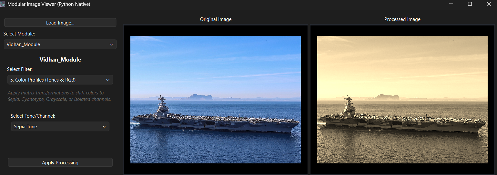 | 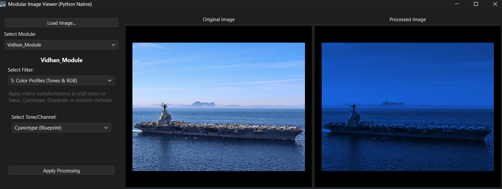 | 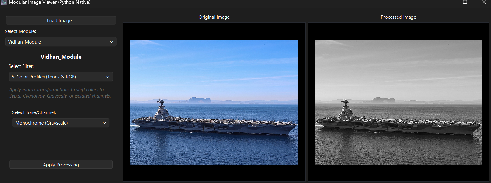 |

| Red Channel | Green Channel | Blue Channel |
|---|---|---|
| 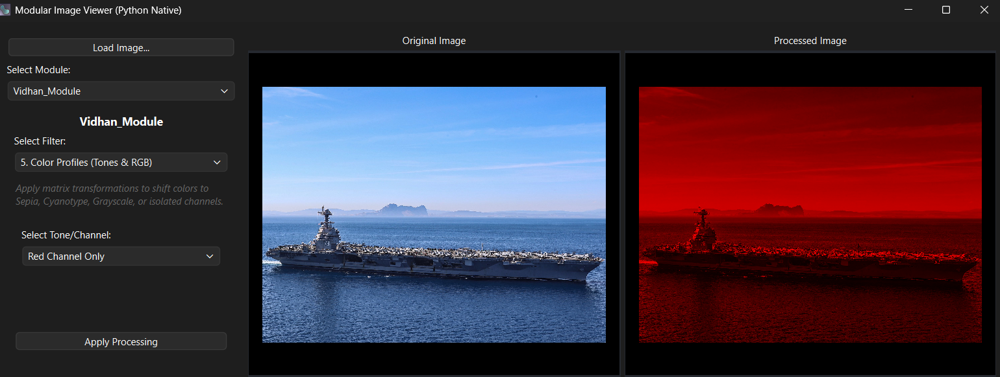 | 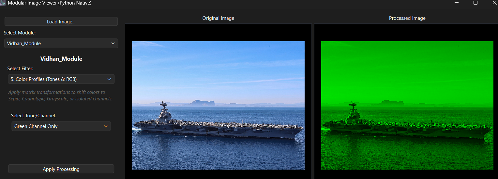 | 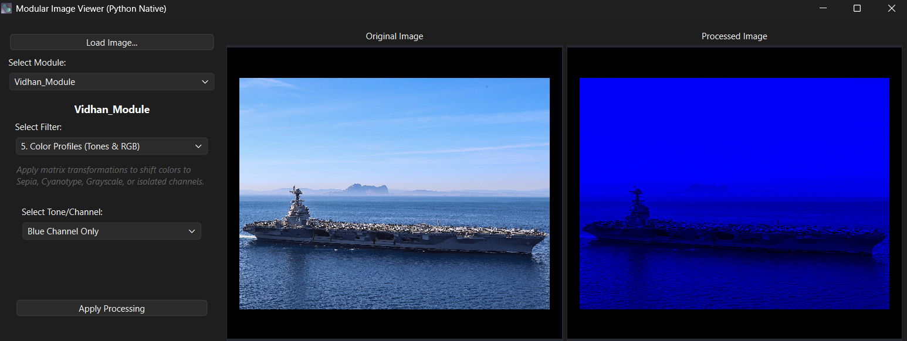 |

| Color Swap (RGB → BGR) | Night Vision (Green Phosphor) | Golden Hour |
|---|---|---|
| _Filter.png>) | _Filter.png>) | 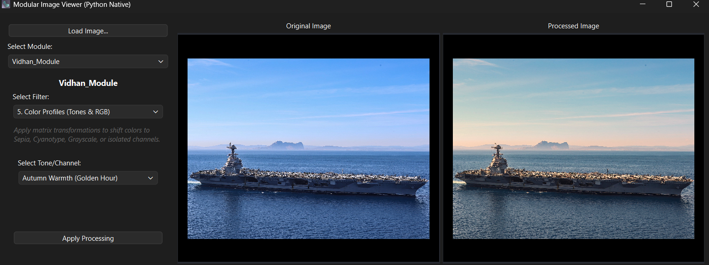 |

---

### 🔹 Interactive GUI (PySide6)

* Dynamic parameter widgets
* Real-time filter selection
* Operation descriptions for user clarity
* Integrated processing feedback

---

##  UX & System Design Enhancements

To ensure usability during compute-heavy operations:

* **UI Responsiveness Handling**

  * `QApplication.processEvents()` ensures UI updates before computation
* **Progress Feedback**

  * Indeterminate progress bar for long operations
* **Safe Interaction Design**

  * Apply button disabled during execution
* **Dynamic UI Rendering**

  * Parameter panels switch based on selected filter
* **User Guidance**

  * Inline descriptions explaining each transformation

---

##  Implemented Operations

### Point Operations

* Negative transformation
* Brightness adjustment (overflow-safe)
* Gamma correction (LUT optimized)
* Binary thresholding
* Solarization
* Vignette effect

| Color Inversion (Negative) | Binary Threshold | Vignette Effect |
|---|---|---|
| _Filter.png>) | 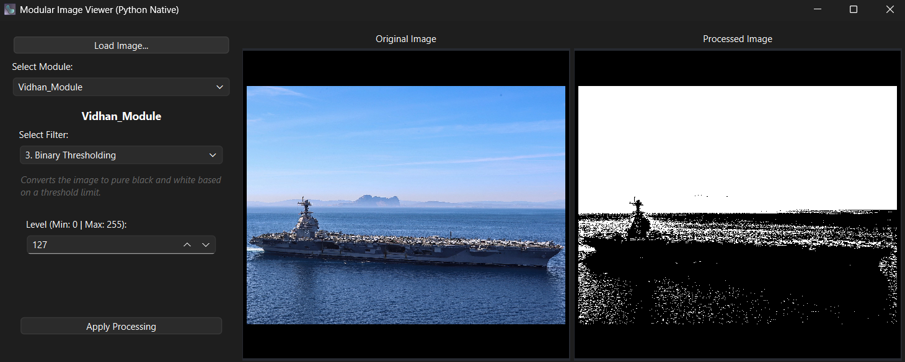 | 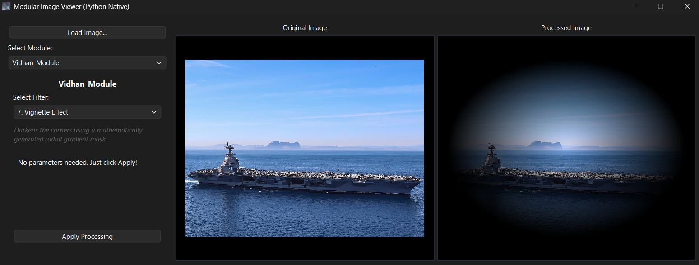 |

| Brightness Adjustment (Dark) | Brightness Adjustment (Light) | Solarization |
|---|---|---|
| .png>) | .png>) | 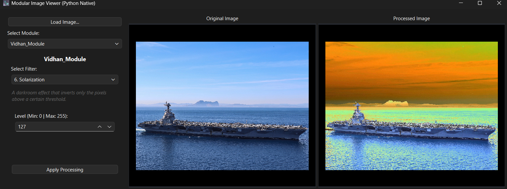 |

| Gamma Correction (Power Law, Min) | Gamma Correction (Power Law, Max) |
|---|---|
| _Filter(Min).png>) | _Filter(Max).png>) |

---

### Spatial Filtering

* Box Blur (3×3 averaging kernel)
* Sharpening (Laplacian kernel)
* Custom convolution engine

---

### Color Transformations

* Matrix-based tone mapping
* Channel manipulation
* Stylized filters

---

### Advanced Computer Vision

* Full Canny Edge Detection pipeline

---

##  How to Run

### 1. Clone the Repository

```bash
git clone https://github.com/VS-CODE-DEVELOPER/Vectorized-Image-Filters.git
cd Vectorized-Image-Filters
```

---

### 2. Create Virtual Environment (Recommended)

**Windows**

```bash
python -m venv venv
.\venv\Scripts\activate
```

**macOS / Linux**

```bash
python3 -m venv venv
source venv/bin/activate
```

---

### 3. Install Dependencies

```bash
pip install -r requirements.txt
```

---

### 4. Run the Application

```bash
cd src
python main_app.py
```

---

##  Usage

1. Launch the application
2. Load an image
3. Select **Vidhan_Module**
4. Choose a filter
5. Adjust parameters
6. Click **Apply Processing**

---

##  Performance

* Optimized using NumPy vectorization
* LUT-based gamma correction reduces computation cost
* Benchmarking built into processing pipeline

Example:

```bash
[Vidhan_Module] Executed 'Canny Edge Detection' in 0.0842 seconds
```

---

##  Architecture

```text
UI Layer (PySide6)
    ↓
Control Panel (Parameter Widgets)
    ↓
Processing Layer (NumPy Algorithms)
    ↓
Module Interface (IImageModule)
    ↓
Application Framework
```

---

##  Limitations

* Non-max suppression and hysteresis use iterative loops (CPU-bound)
* Processing runs on main UI thread (can cause temporary UI freeze)
* No GPU acceleration (future scope)

---

##  Future Work

* Full vectorization of Canny pipeline
* Multi-threading using Qt (`QThread`)
* GPU acceleration (CUDA / CuPy)
* Real-time video processing
* Embedded integration (ESP32-CAM streaming)

---

##  Acknowledgments

This project is based on the academic framework provided by my professor:
https://github.com/guijoe/srh-image-viewer

The original framework supplied the application structure (UI, module system, and core integration).  
The image processing engine, algorithms, and system design have been significantly extended and re-engineered, including:

- Custom NumPy-based filtering pipeline  
- Full Canny Edge Detection implementation (from scratch)  
- Convolution engine with user-defined kernels  
- Performance optimizations and UI enhancements  
---

##  Why This Project Stands Out

* No reliance on high-level CV libraries
* Full algorithmic implementation from first principles
* Strong focus on performance and system design
* Clean modular architecture with UI integration

---